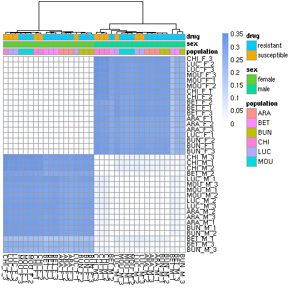

# hcontortus eprinomectin analysis: rna-seq

### author: Stephen Doyle

- RNA-seq analysis of eprinomectin-susceptible and resistant male and female parasites from six farms


## Data

```bash
cd /nfs/users/nfs_s/sd21/lustre_link/haemonchus_contortus/EPRINOMECTIN/RAW/RNASEQ

# use baton from Sam D to download fastq's from iRODs
module load ISG/singularity nextflow

bsub.py 10 baton "nextflow run /nfs/users/nfs_s/sd21/lustre_link/software/nextflow/baton-extractor/main.nf --study 7435 --runid 47866"

# run fastqc
bsub.py --queue long 10 fastqc "~sd21/bash_scripts/run_fastqc"

# once finished, run multiqc

multiqc .
```
[Multiqc report](../04_analysis/rnaseq_multiqc_report.html) 

| lane  | sample_ID |
|----------|---------|
| 48195#1  | CHI_M_1 |
| 48195#2  | CHI_M_2 |
| 48195#3  | CHI_M_3 |
| 48195#4  | CHI_F_1 |
| 48195#5  | CHI_F_2 |
| 48195#6  | CHI_F_3 |
| 48195#7  | BET_M_1 |
| 48195#8  | BET_M_2 |
| 48195#9  | BET_M_3 |
| 48195#10 | BET_F_1 |
| 48195#11 | BET_F_2 |
| 48195#12 | BET_F_3 |
| 48195#13 | LUC_M_1 |
| 48195#14 | LUC_M_2 |
| 48195#15 | LUC_M_3 |
| 48195#16 | LUC_F_1 |
| 48195#17 | LUC_F_2 |
| 48195#18 | LUC_F_3 |
| 48195#19 | ARA_M_1 |
| 48195#20 | ARA_M_2 |
| 48195#21 | ARA_M_3 |
| 48195#22 | ARA_F_1 |
| 48195#23 | ARA_F_2 |
| 48195#24 | ARA_F_3 |
| 48195#25 | BUN_M_1 |
| 48195#26 | BUN_M_2 |
| 48195#27 | BUN_M_3 |
| 48195#28 | BUN_F_1 |
| 48195#29 | BUN_F_2 |
| 48195#30 | BUN_F_3 |
| 48195#31 | MOU_M_1 |
| 48195#32 | MOU_M_2 |
| 48195#33 | MOU_M_3 |
| 48195#34 | MOU_F_1 |
| 48195#35 | MOU_F_2 |
| 48195#36 | MOU_F_3 |


## Reference
```bash
cd /nfs/users/nfs_s/sd21/lustre_link/haemonchus_contortus/EPRINOMECTIN/RAW/REF

# get genome
wget https://ftp.ebi.ac.uk/pub/databases/wormbase/parasite/releases/WBPS18/species/haemonchus_contortus/PRJEB506/haemonchus_contortus.PRJEB506.WBPS18.genomic.fa.gz

# get annotation
wget https://ftp.ebi.ac.uk/pub/databases/wormbase/parasite/releases/WBPS18/species/haemonchus_contortus/PRJEB506/haemonchus_contortus.PRJEB506.WBPS18.annotations.gff3.gz

# get transcripts
wget https://ftp.ebi.ac.uk/pub/databases/wormbase/parasite/releases/WBPS18/species/haemonchus_contortus/PRJEB506/haemonchus_contortus.PRJEB506.WBPS18.mRNA_transcripts.fa.gz

# unzip
for i in *gz; do 
    gunzip ${i}; 
    done

```


## Kalliso
```bash
cd /nfs/users/nfs_s/sd21/lustre_link/haemonchus_contortus/EPRINOMECTIN/MAPPING_RNASEQ

# load kallisto (kallisto 0.50.1)
conda activate kallisto


# index the transcripts
ln -s /nfs/users/nfs_s/sd21/lustre_link/haemonchus_contortus/EPRINOMECTIN/RAW/REF/haemonchus_contortus.PRJEB506.WBPS18.mRNA_transcripts.fa TRANSCRIPTS.fa

kallisto index --index TRANSCRIPTS.ixd TRANSCRIPTS.fa


DATA_DIR=/nfs/users/nfs_s/sd21/lustre_link/haemonchus_contortus/EPRINOMECTIN/RAW/RNASEQ


# run kallisto
DATA_DIR=/nfs/users/nfs_s/sd21/lustre_link/haemonchus_contortus/EPRINOMECTIN/RAW/RNASEQ

while read LANE SAMPLE_ID; do \
    kallisto quant \
     --index TRANSCRIPTS.ixd \
     --output-dir kallisto_${SAMPLE_ID}_out \
     --bootstrap-samples 100 \
     --threads 7 \
     ${DATA_DIR}/${LANE}_1.fastq.gz ${DATA_DIR}/${LANE}_2.fastq.gz >>kallisto_${SAMPLE_ID}.log 2>&1;
done < ${DATA_DIR}/lane_sample_IDs.list &

```


## Sleuth: setup and QC
```bash

cd /nfs/users/nfs_s/sd21/lustre_link/haemonchus_contortus/EPRINOMECTIN/ANALYSIS/RNASEQ

```


```R
library(sleuth)
library(tidyverse)
library(patchwork)

# load metadata for the RNAseq reads processed by kallisto
metadata <- read.table("rnaseq_metadata.txt", header=T)

so <- sleuth_prep(metadata, extra_bootstrap_summary = TRUE, num_cores=2)

```
- where "rnaseq_metadata.txt" contains:

| sample  | population | sex    | drug        | path                                                                                                                 |
|---------|------------|--------|-------------|----------------------------------------------------------------------------------------------------------------------|
| ARA_F_1 | ARA        | female | resistant   | /nfs/users/nfs_s/sd21/lustre_link/haemonchus_contortus/EPRINOMECTIN/MAPPING_RNASEQ/kallisto_ARA_F_1_out/abundance.h5 |
| ARA_F_2 | ARA        | female | resistant   | /nfs/users/nfs_s/sd21/lustre_link/haemonchus_contortus/EPRINOMECTIN/MAPPING_RNASEQ/kallisto_ARA_F_2_out/abundance.h5 |
| ARA_F_3 | ARA        | female | resistant   | /nfs/users/nfs_s/sd21/lustre_link/haemonchus_contortus/EPRINOMECTIN/MAPPING_RNASEQ/kallisto_ARA_F_3_out/abundance.h5 |
| ARA_M_1 | ARA        | male   | resistant   | /nfs/users/nfs_s/sd21/lustre_link/haemonchus_contortus/EPRINOMECTIN/MAPPING_RNASEQ/kallisto_ARA_M_1_out/abundance.h5 |
| ARA_M_2 | ARA        | male   | resistant   | /nfs/users/nfs_s/sd21/lustre_link/haemonchus_contortus/EPRINOMECTIN/MAPPING_RNASEQ/kallisto_ARA_M_2_out/abundance.h5 |
| ARA_M_3 | ARA        | male   | resistant   | /nfs/users/nfs_s/sd21/lustre_link/haemonchus_contortus/EPRINOMECTIN/MAPPING_RNASEQ/kallisto_ARA_M_3_out/abundance.h5 |
| BET_F_1 | BET        | female | susceptible | /nfs/users/nfs_s/sd21/lustre_link/haemonchus_contortus/EPRINOMECTIN/MAPPING_RNASEQ/kallisto_BET_F_1_out/abundance.h5 |
| BET_F_2 | BET        | female | susceptible | /nfs/users/nfs_s/sd21/lustre_link/haemonchus_contortus/EPRINOMECTIN/MAPPING_RNASEQ/kallisto_BET_F_2_out/abundance.h5 |
| BET_F_3 | BET        | female | susceptible | /nfs/users/nfs_s/sd21/lustre_link/haemonchus_contortus/EPRINOMECTIN/MAPPING_RNASEQ/kallisto_BET_F_3_out/abundance.h5 |
| BET_M_1 | BET        | male   | susceptible | /nfs/users/nfs_s/sd21/lustre_link/haemonchus_contortus/EPRINOMECTIN/MAPPING_RNASEQ/kallisto_BET_M_1_out/abundance.h5 |
| BET_M_2 | BET        | male   | susceptible | /nfs/users/nfs_s/sd21/lustre_link/haemonchus_contortus/EPRINOMECTIN/MAPPING_RNASEQ/kallisto_BET_M_2_out/abundance.h5 |
| BET_M_3 | BET        | male   | susceptible | /nfs/users/nfs_s/sd21/lustre_link/haemonchus_contortus/EPRINOMECTIN/MAPPING_RNASEQ/kallisto_BET_M_3_out/abundance.h5 |
| BUN_F_1 | BUN        | female | resistant   | /nfs/users/nfs_s/sd21/lustre_link/haemonchus_contortus/EPRINOMECTIN/MAPPING_RNASEQ/kallisto_BUN_F_1_out/abundance.h5 |
| BUN_F_2 | BUN        | female | resistant   | /nfs/users/nfs_s/sd21/lustre_link/haemonchus_contortus/EPRINOMECTIN/MAPPING_RNASEQ/kallisto_BUN_F_2_out/abundance.h5 |
| BUN_F_3 | BUN        | female | resistant   | /nfs/users/nfs_s/sd21/lustre_link/haemonchus_contortus/EPRINOMECTIN/MAPPING_RNASEQ/kallisto_BUN_F_3_out/abundance.h5 |
| BUN_M_1 | BUN        | male   | resistant   | /nfs/users/nfs_s/sd21/lustre_link/haemonchus_contortus/EPRINOMECTIN/MAPPING_RNASEQ/kallisto_BUN_M_1_out/abundance.h5 |
| BUN_M_2 | BUN        | male   | resistant   | /nfs/users/nfs_s/sd21/lustre_link/haemonchus_contortus/EPRINOMECTIN/MAPPING_RNASEQ/kallisto_BUN_M_2_out/abundance.h5 |
| BUN_M_3 | BUN        | male   | resistant   | /nfs/users/nfs_s/sd21/lustre_link/haemonchus_contortus/EPRINOMECTIN/MAPPING_RNASEQ/kallisto_BUN_M_3_out/abundance.h5 |
| CHI_F_1 | CHI        | female | susceptible | /nfs/users/nfs_s/sd21/lustre_link/haemonchus_contortus/EPRINOMECTIN/MAPPING_RNASEQ/kallisto_CHI_F_1_out/abundance.h5 |
| CHI_F_2 | CHI        | female | susceptible | /nfs/users/nfs_s/sd21/lustre_link/haemonchus_contortus/EPRINOMECTIN/MAPPING_RNASEQ/kallisto_CHI_F_2_out/abundance.h5 |
| CHI_F_3 | CHI        | female | susceptible | /nfs/users/nfs_s/sd21/lustre_link/haemonchus_contortus/EPRINOMECTIN/MAPPING_RNASEQ/kallisto_CHI_F_3_out/abundance.h5 |
| CHI_M_1 | CHI        | male   | susceptible | /nfs/users/nfs_s/sd21/lustre_link/haemonchus_contortus/EPRINOMECTIN/MAPPING_RNASEQ/kallisto_CHI_M_1_out/abundance.h5 |
| CHI_M_2 | CHI        | male   | susceptible | /nfs/users/nfs_s/sd21/lustre_link/haemonchus_contortus/EPRINOMECTIN/MAPPING_RNASEQ/kallisto_CHI_M_2_out/abundance.h5 |
| CHI_M_3 | CHI        | male   | susceptible | /nfs/users/nfs_s/sd21/lustre_link/haemonchus_contortus/EPRINOMECTIN/MAPPING_RNASEQ/kallisto_CHI_M_3_out/abundance.h5 |
| LUC_F_1 | LUC        | female | susceptible | /nfs/users/nfs_s/sd21/lustre_link/haemonchus_contortus/EPRINOMECTIN/MAPPING_RNASEQ/kallisto_LUC_F_1_out/abundance.h5 |
| LUC_F_2 | LUC        | female | susceptible | /nfs/users/nfs_s/sd21/lustre_link/haemonchus_contortus/EPRINOMECTIN/MAPPING_RNASEQ/kallisto_LUC_F_2_out/abundance.h5 |
| LUC_F_3 | LUC        | female | susceptible | /nfs/users/nfs_s/sd21/lustre_link/haemonchus_contortus/EPRINOMECTIN/MAPPING_RNASEQ/kallisto_LUC_F_3_out/abundance.h5 |
| LUC_M_1 | LUC        | male   | susceptible | /nfs/users/nfs_s/sd21/lustre_link/haemonchus_contortus/EPRINOMECTIN/MAPPING_RNASEQ/kallisto_LUC_M_1_out/abundance.h5 |
| LUC_M_2 | LUC        | male   | susceptible | /nfs/users/nfs_s/sd21/lustre_link/haemonchus_contortus/EPRINOMECTIN/MAPPING_RNASEQ/kallisto_LUC_M_2_out/abundance.h5 |
| LUC_M_3 | LUC        | male   | susceptible | /nfs/users/nfs_s/sd21/lustre_link/haemonchus_contortus/EPRINOMECTIN/MAPPING_RNASEQ/kallisto_LUC_M_3_out/abundance.h5 |
| MOU_F_1 | MOU        | female | resistant   | /nfs/users/nfs_s/sd21/lustre_link/haemonchus_contortus/EPRINOMECTIN/MAPPING_RNASEQ/kallisto_MOU_F_1_out/abundance.h5 |
| MOU_F_2 | MOU        | female | resistant   | /nfs/users/nfs_s/sd21/lustre_link/haemonchus_contortus/EPRINOMECTIN/MAPPING_RNASEQ/kallisto_MOU_F_2_out/abundance.h5 |
| MOU_F_3 | MOU        | female | resistant   | /nfs/users/nfs_s/sd21/lustre_link/haemonchus_contortus/EPRINOMECTIN/MAPPING_RNASEQ/kallisto_MOU_F_3_out/abundance.h5 |
| MOU_M_1 | MOU        | male   | resistant   | /nfs/users/nfs_s/sd21/lustre_link/haemonchus_contortus/EPRINOMECTIN/MAPPING_RNASEQ/kallisto_MOU_M_1_out/abundance.h5 |
| MOU_M_2 | MOU        | male   | resistant   | /nfs/users/nfs_s/sd21/lustre_link/haemonchus_contortus/EPRINOMECTIN/MAPPING_RNASEQ/kallisto_MOU_M_2_out/abundance.h5 |
| MOU_M_3 | MOU        | male   | resistant   | /nfs/users/nfs_s/sd21/lustre_link/haemonchus_contortus/EPRINOMECTIN/MAPPING_RNASEQ/kallisto_MOU_M_3_out/abundance.h5 |


### PCAs
- handy tutorial on PCAs for RNAseq data: https://tavareshugo.github.io/data-carpentry-rnaseq/03_rnaseq_pca.html 

```R
so <- sleuth_prep(metadata, extra_bootstrap_summary = TRUE, num_cores=2)

pca_matrix <- sleuth:::spread_abundance_by(so$obs_norm, "est_counts", so$sample_to_covariates$sample)

sample_pca <- prcomp(t(pca_matrix))

# "sdev" contains the standard deviation explained by each PC, so if we square it we get the eigenvalues (or explained variance)
# "rotation" contains the variable loadings for each PC, which define the eigenvectors
# "x" contains the PC scores, i.e. the data projected on the new PC axis
# "center" in this case contains the mean of each gene, which was subtracted from each value
# "scale" contains the value FALSE because we did not scale the data by the standard deviation 


pc_eigenvalues <- tibble(PC = factor(1:length(pc_eigenvalues)), 
                         variance = pc_eigenvalues) %>% 
  # add a new column with the percent variance
  mutate(pct = variance/sum(variance)*100) %>% 
  # add another column with the cumulative variance explained
  mutate(pct_cum = cumsum(pct))

# print the result
pc_eigenvalues


# The PC scores are stored in the "x" value of the prcomp object
pc_scores <- sample_pca$x

pc_scores <- pc_scores %>% 
  # convert to a tibble retaining the sample names as a new column
  as_tibble(rownames = "sample")

# print the result
pc_scores


pc_scores <- dplyr::left_join(pc_scores, so$sample_to_covariates, by = "sample")


plot_pca_pop <-
    ggplot(pc_scores, aes(x = PC1, y = PC2, col=population)) +
    geom_point() +
    theme_bw() +
    labs(x = paste0("PC1 variance: ",round(pc_eigenvalues$pct[1],digits=2),"%"),
        y = paste0("PC2 variance: ",round(pc_eigenvalues$pct[2],digits=2),"%"))

plot_pca_sex <-
    ggplot(pc_scores, aes(x = PC1, y = PC2, col=sex)) +
    geom_point() +
    theme_bw() +
    labs(x = paste0("PC1 variance: ",round(pc_eigenvalues$pct[1],digits=2),"%"),
        y = paste0("PC2 variance: ",round(pc_eigenvalues$pct[2],digits=2),"%"))

plot_pca_drug <-
    ggplot(pc_scores, aes(x = PC1, y = PC2, col=drug)) +
    geom_point() +
    theme_bw() +
    labs(x = paste0("PC1 variance: ",round(pc_eigenvalues$pct[1],digits=2),"%"),
        y = paste0("PC2 variance: ",round(pc_eigenvalues$pct[2],digits=2),"%"))


plot_pca_pop + plot_pca_sex + plot_pca_drug + plot_layout(ncol=3)

ggsave("figure_rnaseq_pca_pop_sex_drug.png")
```


```R


abund <- sleuth:::spread_abundance_by(so$obs_norm, "tpm", so$sample_to_covariates$sample)

all_pairs <- sleuth:::apply_all_pairs(abund, sleuth:::jsd)

s2c <- so$sample_to_covariates

rownames(s2c) <- s2c$sample
annotation_cols = setdiff(colnames(so$sample_to_covariates),"sample")
s2c <- s2c[, annotation_cols, drop = FALSE]

color_high = "white"
color_low = "cornflowerblue"

    colors <- colorRampPalette(c(color_high, color_low))(100)
    
pdf(file = "figure_rnaseq_heatmap_pop_sex_drug.pdf")
    
pheatmap::pheatmap(all_pairs, annotation_col = s2c,
    color = colors, cluster_rows = TRUE, cluster_cols = TRUE,
    clustering_distance_cols = dist(all_pairs), clustering_distance_rows = dist(all_pairs),
    treeheight_row = 0)

 dev.off()

png(file = "figure_rnaseq_heatmap_pop_sex_drug.png")
    
pheatmap::pheatmap(all_pairs, annotation_col = s2c,
    color = colors, cluster_rows = TRUE, cluster_cols = TRUE,
    clustering_distance_cols = dist(all_pairs), clustering_distance_rows = dist(all_pairs),
    treeheight_row = 0)

 dev.off()
```



 ## Sleuth: differential expression


```
echo -e "target_id\tgene_id" > transcripts_genes.list

grep ">" ../../RAW/REF/haemonchus_contortus.PRJEB506.WBPS18.mRNA_transcripts.fa | awk '{print}' OFS="\t" | sed -e 's/>//g' -e 's/gene=//' >> transcripts_genes.list

```


```R
# working dir: /nfs/users/nfs_s/sd21/lustre_link/haemonchus_contortus/EPRINOMECTIN/ANALYSIS/RNASEQ

library(sleuth)
library(tidyverse)
library(patchwork)

# load metadata for the RNAseq reads processed by kallisto
metadata <- read.table("rnaseq_metadata.txt", header=T)

transcripts_genes <- read.table("transcripts_genes.list", header=T)


so <- sleuth_prep(metadata, target_mapping = transcripts_genes,
  aggregation_column = 'gene_id', extra_bootstrap_summary = TRUE, num_cores=2)


# first step: reduced model, with only sex and population (no drug) 
so <- sleuth_fit(so, ~sex + population, 'reduced')

# second step: full model , now accounting for drug 
so <- sleuth_fit(so, ~sex + population + drug, 'full')

# third step: likelihood ratio test, sleuth identifies genes whose abundances are significantly better explained when drug is taken into account, while accounting for baseline differences that may be explained by sex and population
so <- sleuth_lrt(so, 'reduced', 'full')

sleuth_table_gene <- sleuth_results(so, 'reduced:full', 'lrt', show_all = FALSE)

sleuth_table_gene <- dplyr::filter(sleuth_table_gene, qval <= 0.05)
```


so <- sleuth_fit(so, ~sex, 'reduced')

# second step: full model , now accounting for drug 
so <- sleuth_fit(so, ~sex + drug, 'full')